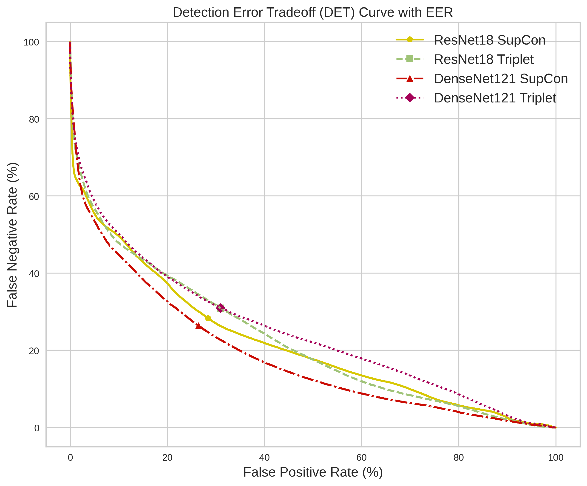
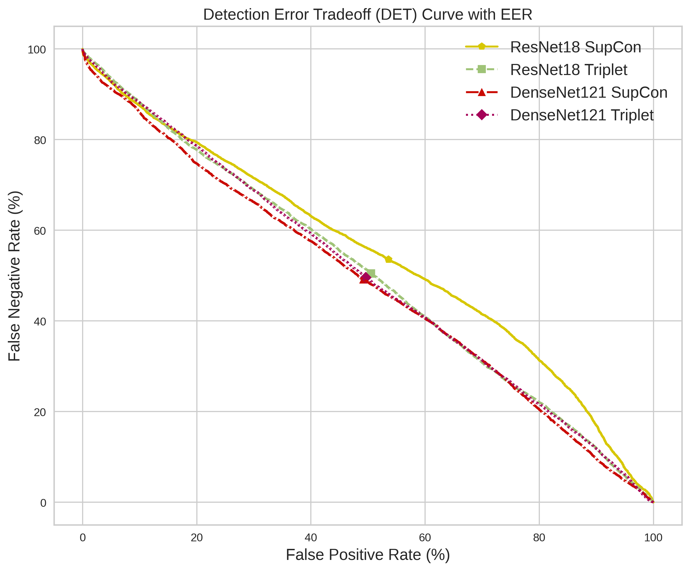
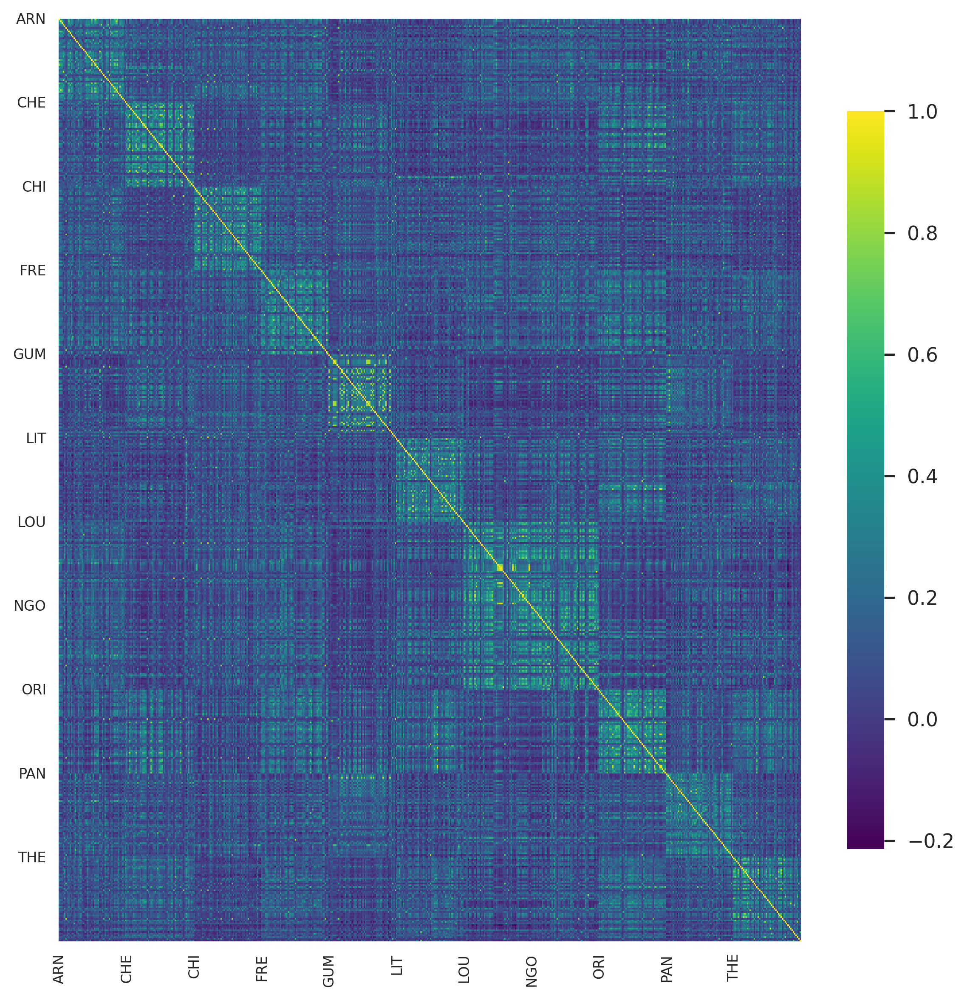
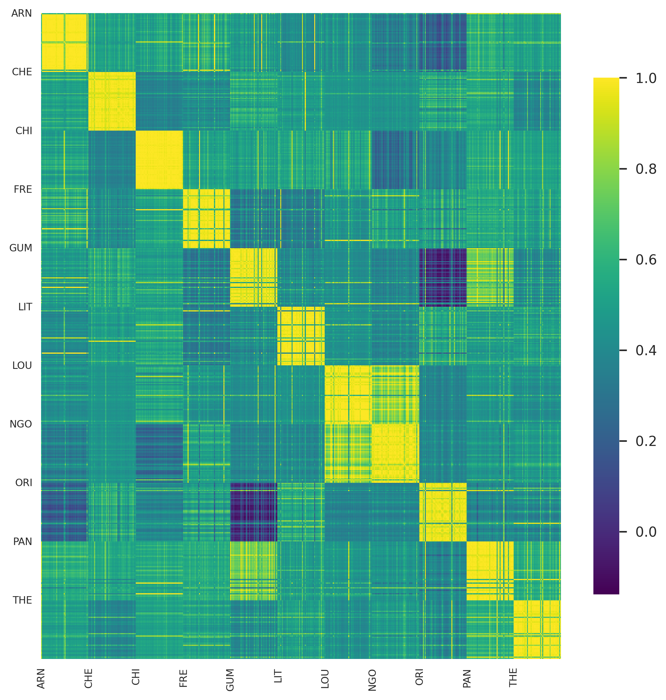
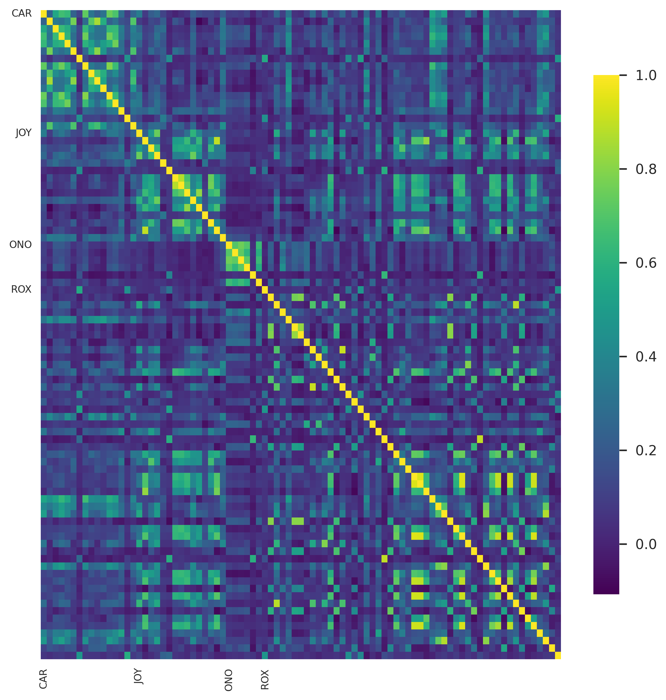
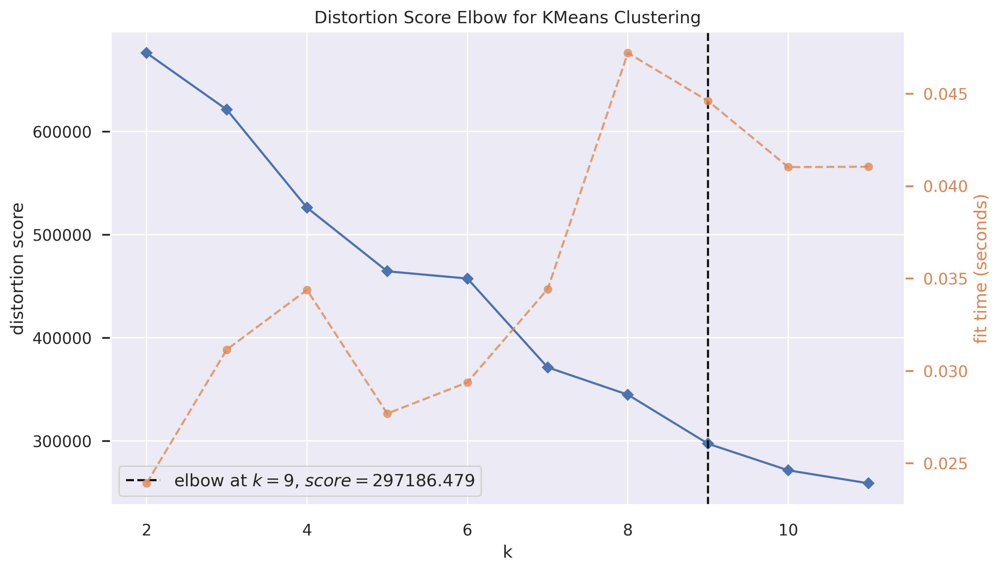
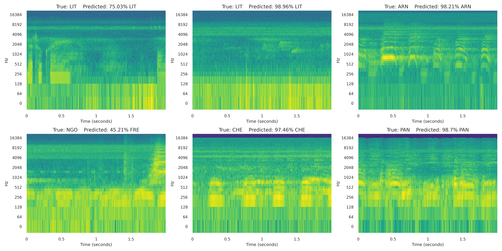
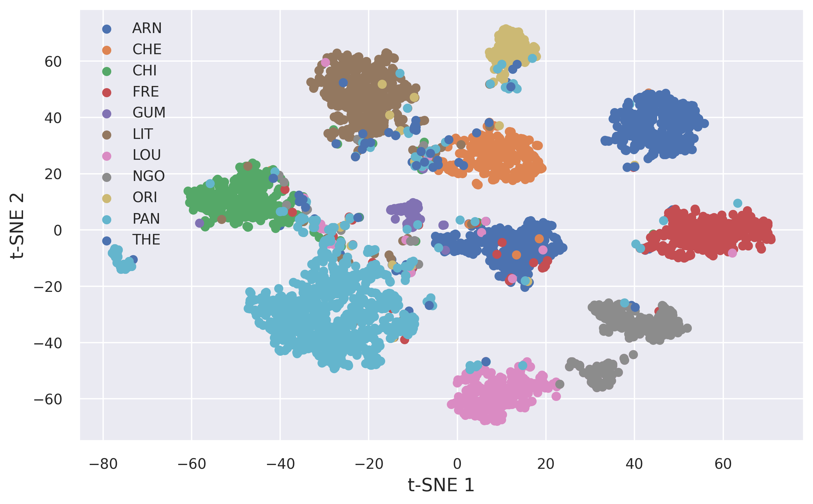
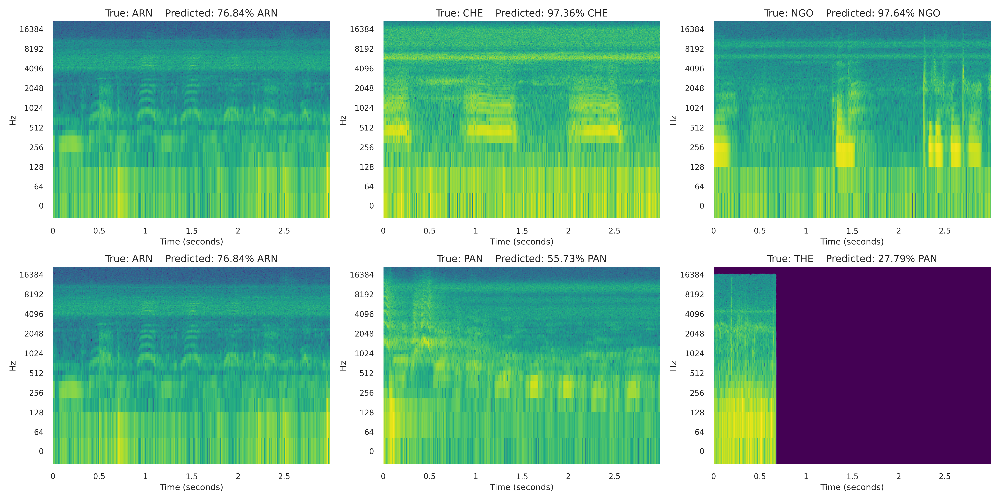
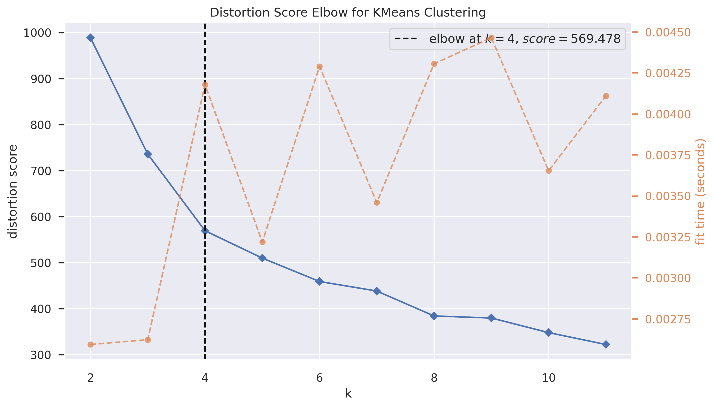

# Deep Learning for Recognizing Individual Chimpanzees from Vocalizations

## High-Level Workflow to Run the Experiments

### Clone the Repository
```bash
git clone git@github.com:yusufbrima/IVRContrastive.git
cd IVRContrastive
```

### Create and Activate Conda Environment
```bash
conda env create -f environment.yml
conda activate deepc
```

### Configure Data, Model Architectures, and Hyperparameters
Modify the settings in `config.py` as needed.

### Split the Dataset
Run the following script to split the dataset into training and validation sets:
```bash
python data_split.py
```

### Train the Classifiers
Run the `run_trainer.sh` bash script to train the classifiers for n experimental runs. Alternatively, use the following command:
```bash
python trainer.py --modelstr dense121 --experiment 1 --target_class chimpanzee_ir
```

#### CLI Arguments for `trainer.py`
- `--modelstr`: Model architecture (options: `dense121`, `resnet18`)
- `--experiment`: Non-negative integer for the experiment identifier
- `--target_class`: Target class for training (e.g., `chimpanzee_ir`)

### Contrastive Pre-Training
Run the `run_pretrain.sh` bash script where the `PYTHON_SCRIPT` variable is set to `contrastive.py`. Alternatively, use the following command:
```bash
python3 contrastive.py --experiment 1 --target_class chimpanzee_ir --modelstr dense121 --contrastive_method supcon
```

#### CLI Arguments for `contrastive.py`
- `--experiment`: Non-negative integer for an already pre-trained contrastive model
- `--target_class`: Target class for training (e.g., `chimpanzee_ir`)
- `--modelstr`: Model architecture (options: `dense121`, `resnet18`)
- `--contrastive_method`: Contrastive method (options: `triplet`, `supcon`)

### Linear Probing on Trained Models
Run the `run_finetune.sh` bash script where the `PYTHON_SCRIPT` variable is set to `linear_probing.py`. Alternatively, use the following command:
```bash
python3 linear_probing.py --experiment 1 --target_class chimpanzee_ir --modelstr dense121 --contrastive_method supcon
```

#### CLI Arguments for `linear_probing.py`
- `--experiment`: Non-negative integer for an already pre-trained contrastive model
- `--target_class`: Target class for training (e.g., `chimpanzee_ir`)
- `--modelstr`: Model architecture (options: `dense121`, `resnet18`)
- `--contrastive_method`: Contrastive method (options: `triplet`, `supcon`)

### Fine-Tuning Pre-Trained Models
Run the `run_finetune.sh` bash script where the `PYTHON_SCRIPT` variable is set to `finetune.py`. Alternatively, use the following command:
```bash
python3 finetune.py --experiment 1 --target_class chimpanzee_ir --modelstr dense121 --contrastive_method supcon
```

#### CLI Arguments for `finetune.py`
- `--experiment`: Non-negative integer for an already pre-trained contrastive model
- `--target_class`: Target class for training (e.g., `chimpanzee_ir`)
- `--modelstr`: Model architecture (options: `dense121`, `resnet18`)
- `--contrastive_method`: Contrastive method (options: `triplet`, `supcon`)

### Extracting Learned Representations
Run the `run_representations.sh` bash script to extract all representations for both top-performing classifiers and contrastive models. Alternatively, use the following command:
```bash
python extract_rep.py --modelstr dense121 --target_class chimpanzee_ir --model_type dense121 --method supcon --experiment 1
```

### Plotting DET EER Curves
To plot the DET EER curves, run:
```bash
python det_plot.py
```
To get the results for females, set the `females` variable; otherwise, leave it as `null`.

### Saliency Analysis of Trained Models
Run the following command for saliency analysis:
```bash
python saliency.py --ft True --target_class chimpanzee_ir --method supcon --experiment 1 --contrastive_method triplet
```

#### CLI Arguments for `saliency.py`
- `--experiment`: Non-negative integer for an already pre-trained contrastive model
- `--target_class`: Target class for training (e.g., `chimpanzee_ir`)
- `--modelstr`: Model architecture (options: `dense121`, `resnet18`)
- `--contrastive_method`: Contrastive method (options: `triplet`, `supcon`)
- `--model_type`: Model type (options: `classifier`, `contrastive`)
- `--ft`: Boolean flag to indicate whether to use fine-tuned models
- `--duration`: Duration of the selected audios to use in the batch

## Additional Information

### Sample Predictions
Details and results of sample predictions.

### DET Curves
Visualization and analysis of Detection Error Tradeoff (DET) curves.





### Heatmaps for In-Distribution Data
Analysis of heatmaps for in-distribution data.





### Heatmaps for Out-of-Distribution Data
Analysis of heatmaps for out-of-distribution data.



### Sample Saliency Maps
Visualization and interpretation of sample saliency maps.


### Cluster Size Prediction






### Embedding Structure


### Sample Predictions





## Further Result Analysis and Visualization
Further result analysis and visualization can be found in `Playground.ipynb`.

## Acknowledgement
We thank the Agence Nationale des Parcs Nationaux and the Centre National de la Recherche Scientifique et Technique of Gabon for their collaboration and permission to conduct research in the Loango National Park. Special thanks to C. Boesch, T. Deschner, A. Mascaro, F. Makaya, U. Bora Moussouami, and the Ozouga Research Team for their invaluable assistance and support. This work was funded by the Deutsche Forschungsgemeinschaft (DFG) under the "Computational Cognition" research training group (GRK2340) and an EU-Consolidator grant (772000, TurnTaking) from the European Research Council (ERC) under the EU's Horizon 2020 programme.